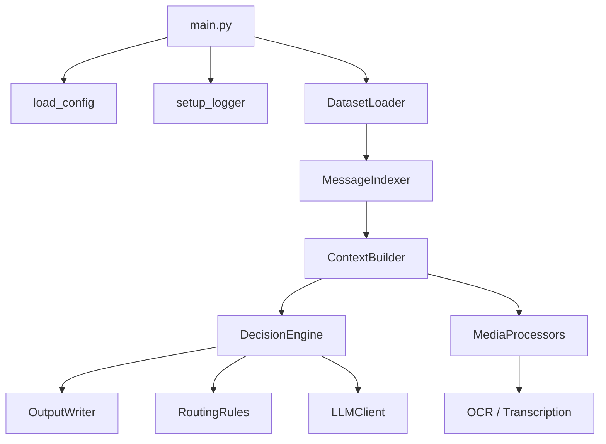

# Architecture

## Overview

The WhatsApp Message Notification Router is an AI-powered system that reads CSV datasets, images, and voice notes, then produces routing decisions in `output.csv`.

Each row in the output contains:

| Column | Description |
|---|---|
| `message_id` | Unique message identifier |
| `action` | Routing action: `notify`, `digest`, or `mute` |
| `message_type` | Conversation type: `personal`, `group`, or `business` |
| `reason` | Human-readable justification |
| `confidence` | Confidence score in `[0.0, 1.0]` |
| `evidence_message_ids` | Supporting message IDs |

## Design Principles

- **Separation of concerns** — Each module owns one responsibility.
- **Interface-first** — External capabilities (LLM, OCR, transcription) are defined as abstract interfaces.
- **Incremental build** — Stubs and TODOs mark future implementation points.
- **No magic numbers** — All tunables live in `code/config.py`.
- **Single source of truth** — Domain strings and enums live in `code/schemas.py`.

## Directory Structure

```
code/
├── main.py                  # Pipeline orchestration (no business logic)
├── config.py                # Centralized configuration
├── schemas.py               # Enums and output schema constants
├── data/
│   ├── models.py            # Domain dataclasses
│   ├── loader.py            # CSV loading only
│   ├── indexer.py           # In-memory indexes
│   └── context_builder.py   # MessageContext assembly
├── media/
│   ├── image_processor.py   # Image loading only
│   ├── voice_processor.py   # Audio loading only
│   ├── ocr.py               # OCR provider interface
│   └── transcription.py     # Transcription provider interface
├── reasoning/
│   ├── llm_client.py        # LLM provider interface
│   ├── prompt_builder.py    # Prompt construction (stub)
│   ├── decision_engine.py   # Routing decision interface
│   └── confidence.py        # Confidence scoring interface
├── rules/
│   ├── routing_rules.py     # Deterministic rule signatures
│   ├── safety.py            # Safety check interface
│   ├── validator.py         # Output validation interface
│   └── prompt_injection.py  # Injection detection interface
├── evaluation/
│   ├── evaluator.py         # Evaluation orchestration interface
│   └── metrics.py           # Metrics dataclasses and interface
├── output/
│   └── writer.py            # CSV output writer
└── utils/
    ├── logger.py            # Project logger
    ├── helpers.py           # Utility functions
    └── timer.py             # Timing decorator/context manager

tests/                       # Test suite (to be populated)
docs/
└── architecture.md          # This document
```

## Pipeline Flow



## Module Responsibilities

### Entry Point (`main.py`)

Orchestrates the full pipeline:

1. Load configuration
2. Initialize logger
3. Load CSV datasets
4. Build indexes
5. Process every message
6. Write output

Contains **no business logic**.

### Data Layer (`data/`)

| Module | Responsibility |
|---|---|
| `models.py` | Frozen dataclasses: `Message`, `User`, `Group`, `Business`, `MessageContext`, etc. |
| `loader.py` | Load CSV files into row dictionaries |
| `indexer.py` | Build efficient lookup indexes |
| `context_builder.py` | Assemble `MessageContext` from indexed data |

### Media Layer (`media/`)

| Module | Responsibility |
|---|---|
| `image_processor.py` | Load and validate image files |
| `voice_processor.py` | Load and validate audio files |
| `ocr.py` | Abstract OCR provider interface |
| `transcription.py` | Abstract transcription provider interface |

### Reasoning Layer (`reasoning/`)

| Module | Responsibility |
|---|---|
| `llm_client.py` | Abstract LLM provider interface |
| `prompt_builder.py` | Construct prompts from context (stub) |
| `decision_engine.py` | Abstract routing decision interface |
| `confidence.py` | Abstract confidence scoring interface |

### Rules Layer (`rules/`)

| Module | Responsibility |
|---|---|
| `routing_rules.py` | Deterministic rule function signatures |
| `safety.py` | Safety validation interface |
| `validator.py` | Output schema validation interface |
| `prompt_injection.py` | Prompt injection detection interface |

### Evaluation Layer (`evaluation/`)

| Module | Responsibility |
|---|---|
| `evaluator.py` | Evaluation orchestration interface |
| `metrics.py` | `EvaluationMetrics` dataclass and calculator interface |

### Output Layer (`output/`)

| Module | Responsibility |
|---|---|
| `writer.py` | Serialize `Prediction` objects to CSV |

### Utilities (`utils/`)

| Module | Responsibility |
|---|---|
| `logger.py` | Reusable project logger (no `print()`) |
| `helpers.py` | General utility functions |
| `timer.py` | Performance timing decorator and context manager |

## Configuration

All tunable parameters are defined in `code/config.py`:

- `MAX_HISTORY_MESSAGES`
- `MAX_EVIDENCE_MESSAGES`
- `MAX_LLM_RETRIES`
- `MAX_IMAGE_SIZE_MB`
- `MAX_AUDIO_DURATION_SEC`
- `DEFAULT_CONFIDENCE`
- `ENABLE_MEDIA`
- `ENABLE_RULE_ENGINE`
- `ENABLE_EVALUATION`

## Schemas

Domain constants in `code/schemas.py`:

- **Actions**: `notify`, `digest`, `mute`
- **Conversation types**: `personal`, `group`, `business`
- **Media types**: `text`, `image`, `voice`
- **Output columns**: defined in `OUTPUT_COLUMNS`

## Running

```bash
python -m code.main --data-dir data --output output.csv
```

## Incremental Implementation Plan

1. **Data parsing** — Convert CSV rows to domain models and populate indexer
2. **Context building** — Implement history gathering in `ContextBuilder`
3. **Rule engine** — Implement deterministic rules in `routing_rules.py`
4. **Media pipeline** — Wire OCR and transcription providers
5. **LLM reasoning** — Implement prompt builder and decision engine
6. **Safety & validation** — Implement safety checks and output validation
7. **Evaluation** — Implement metrics calculator and evaluator
